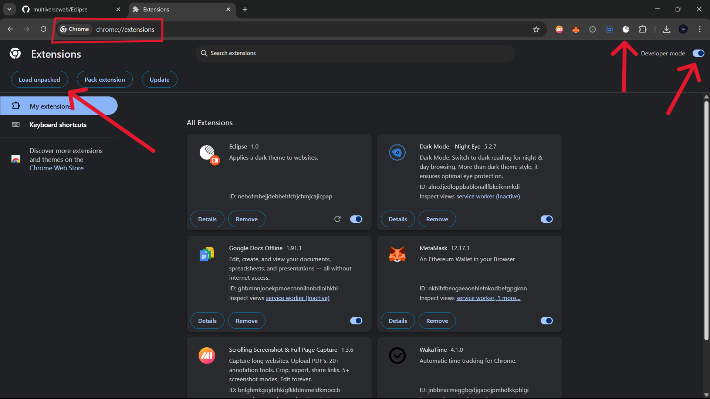
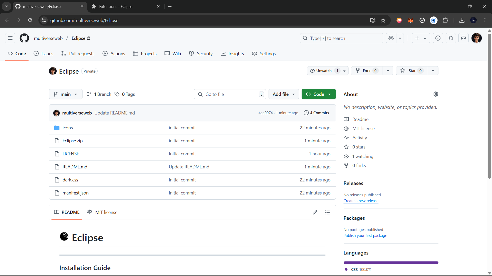
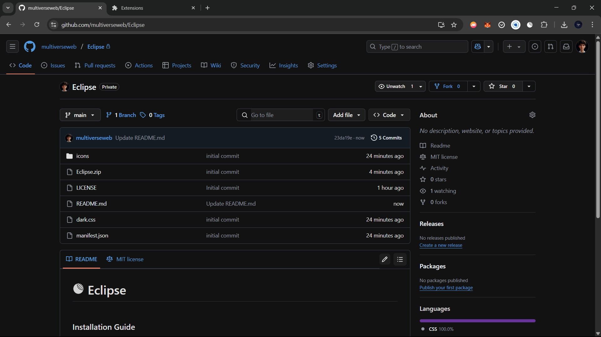

#  Eclipse
---
### Installation Guide

- [Click here](https://github.com/multiverseweb/Eclipse/raw/refs/heads/main/Eclipse.zip) to download the `Eclipse.zip`.
Or 
Clone this repository using Git: 
```
git clone https://github.com/multiverseweb/Eclipse.git
```

- Unzip the downloaded folder and extract it to a safe location on your computer.

- Visit `chrome://extensions` in your browser.

- Enable Developer Mode at the top right of the page.

- Click "Load Unpacked".



Select the folder **`Eclipse`** where you unzipped the extension.

- Done! The extension should now appear in your browser toolbar.

|Before|After|
|:---:|:---:|
|  |  |
